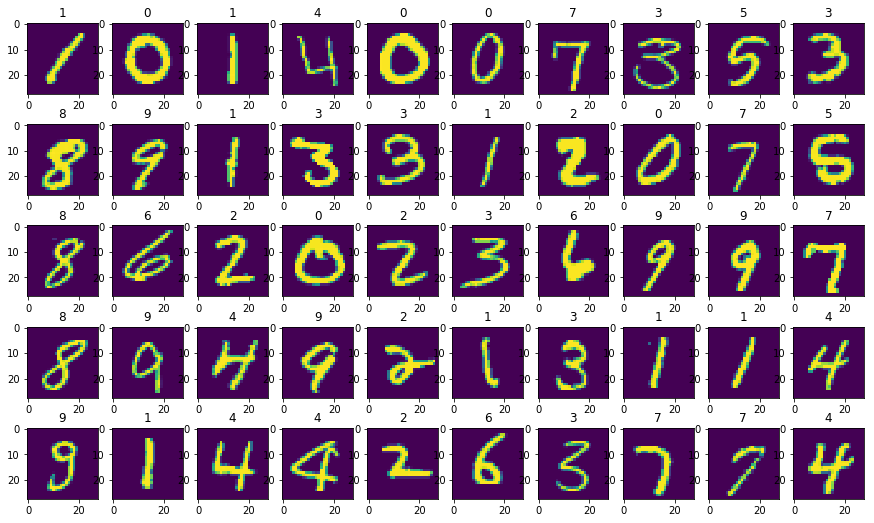
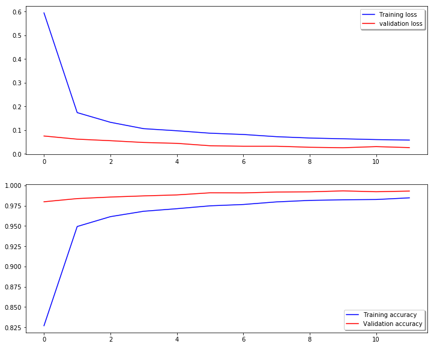

1.import packages and data


```python
# packages
import pandas as pd
import numpy as np
import matplotlib.pyplot as plt
import seaborn as sns

import keras
from keras.models import Sequential
from keras.layers import Dense, Dropout, Flatten,BatchNormalization
from keras.layers import Conv2D, MaxPooling2D
from keras.preprocessing.image import ImageDataGenerator
from keras.callbacks import LearningRateScheduler


from sklearn.model_selection import train_test_split
from sklearn.preprocessing import StandardScaler
from sklearn.metrics import confusion_matrix

```
    Using TensorFlow backend.


```python
# data
train = pd.read_csv("../input/train.csv")
test = pd.read_csv("../input/test.csv")
train.columns
```


    Index(['label', 'pixel0', 'pixel1', 'pixel2', 'pixel3', 'pixel4', 'pixel5',
           'pixel6', 'pixel7', 'pixel8',
           ...
           'pixel774', 'pixel775', 'pixel776', 'pixel777', 'pixel778', 'pixel779',
           'pixel780', 'pixel781', 'pixel782', 'pixel783'],
          dtype='object', length=785)


2.data pre-processing


```python
# data and target
x_train = train.drop("label",axis = 1)
y = train.label
del train
```


```python
# check NAs
print("There are %s NAs in x_train" %x_train.isnull().sum().sum())
print("There are %s NAs in y" %y.isnull().sum().sum())
```

    There are 0 NAs in x_train
    There are 0 NAs in y


```python
# visualization first 50 images in MNIST
plt.figure(figsize=(15,9))
for i in range(50):
    plt.subplot(5,10,1+i)
    plt.title(y[i])
    plt.imshow(x_train.values[i].reshape(28,28))
```




```python
# reshape

# img reshape size
img_rows, img_cols = 28, 28

# reshape to (input_row,img_rows,img_cols,canal)
x_train = x_train.values.reshape(x_train.shape[0], img_rows, img_cols, 1)
test = test.values.reshape(test.shape[0], img_rows, img_cols, 1)
input_shape = (img_rows, img_cols, 1)

print('x_train shape:', x_train.shape)
print(x_train.shape[0], 'train samples')
print(test.shape[0], 'test samples')
```

    x_train shape: (42000, 28, 28, 1)
    42000 train samples
    28000 test samples


```python
# change format and normalization
x_train.astype("float32")
#x_train = StandardScaler().fit_transform(x_train)
x_train = x_train / 255
test.astype("float32")
#test = StandardScaler().fit_transform(test)
test = test / 255
y.astype("int32")

print('x_train shape:', x_train.shape)
print(x_train.shape[0], 'train samples')
print(test.shape[0], 'test samples')
```

    x_train shape: (42000, 28, 28, 1)
    42000 train samples
    28000 test samples


```python
# decimal to binary
y = keras.utils.np_utils.to_categorical(y, num_classes = 10)
print('y shape:', y.shape)
```

    y shape: (42000, 10)


```python
# train_test_split
X_train,X_test,Y_train,Y_test = train_test_split(x_train,y,test_size = .2,random_state = 13)
```

3.Define model


```python
# set up model
model = Sequential()

# first conv2d, 32 output space, activation function is relu, kernel shape 3,3
model.add(Conv2D(32,activation = "relu",input_shape = input_shape,kernel_size=(3,3)))
# batch normalization
model.add(BatchNormalization())
# second conv2d, 64 output space, activation function is relu, kernel shape 3,3
model.add(Conv2D(64,activation="relu",kernel_size=(3,3)))
# batch normalization
model.add(BatchNormalization())
# maxpooling size 2,2
model.add(MaxPooling2D(pool_size=(2,2)))
# dropout .35
model.add(Dropout(.35))

# first conv2d, 32 output space, activation function is relu, kernel shape 3,3
model.add(Conv2D(64,activation = "relu",kernel_size=(3,3)))
# batch normalization
model.add(BatchNormalization())
# second conv2d, 64 output space, activation function is relu, kernel shape 3,3
model.add(Conv2D(64,activation="relu",kernel_size=(3,3)))
# batch normalization
model.add(BatchNormalization())
# maxpooling size 2,2
model.add(MaxPooling2D(pool_size=(2,2)))
# dropout .35
model.add(Dropout(.35))


# flatten all elements
model.add(Flatten())
# add dense layer
model.add(Dense(256,activation="relu"))
# dropout .5
model.add(Dropout(.5))
# output layer 10 with softmax
model.add(Dense(10,activation="softmax"))
```

4.Compile and Augmentation


```python
# compile
model.compile(loss = keras.metrics.categorical_crossentropy,
             optimizer = keras.optimizers.RMSprop(),
             metrics = ["accuracy"])

# augmentation
aug_data = ImageDataGenerator(zoom_range = .1,
                             rotation_range = 10,
                             width_shift_range = .1,
                             height_shift_range = .1,
                             shear_range = .1)
# reduced learning rate
learning_rate = LearningRateScheduler(lambda x : 0.001 * .9 ** x)
# learning_rate = keras.callbacks.ReduceLROnPlateau(monitor='val_loss', factor=0.1, patience=10,
#                                                  verbose=0, mode='auto', min_delta=0.0001, cooldown=0, min_lr=0)
```


```python
# fit
mod = model.fit_generator(aug_data.flow(X_train,Y_train,batch_size=128),epochs=12,verbose=1,
                          validation_data=(X_test,Y_test),callbacks=[learning_rate])
```

    Epoch 1/12
    263/263 [==============================] - 254s 966ms/step - loss: 0.5941 - acc: 0.8270 - val_loss: 0.0751 - val_acc: 0.9799
    Epoch 2/12
    263/263 [==============================] - 253s 961ms/step - loss: 0.1737 - acc: 0.9494 - val_loss: 0.0617 - val_acc: 0.9838
    Epoch 3/12
    263/263 [==============================] - 255s 969ms/step - loss: 0.1328 - acc: 0.9616 - val_loss: 0.0553 - val_acc: 0.9857
    Epoch 4/12
    263/263 [==============================] - 256s 973ms/step - loss: 0.1059 - acc: 0.9682 - val_loss: 0.0478 - val_acc: 0.9871
    Epoch 5/12
    263/263 [==============================] - 254s 968ms/step - loss: 0.0973 - acc: 0.9713 - val_loss: 0.0441 - val_acc: 0.9883
    Epoch 6/12
    263/263 [==============================] - 255s 971ms/step - loss: 0.0873 - acc: 0.9748 - val_loss: 0.0339 - val_acc: 0.9910
    Epoch 7/12
    263/263 [==============================] - 255s 971ms/step - loss: 0.0815 - acc: 0.9765 - val_loss: 0.0319 - val_acc: 0.9908
    Epoch 8/12
    263/263 [==============================] - 254s 967ms/step - loss: 0.0725 - acc: 0.9797 - val_loss: 0.0319 - val_acc: 0.9919
    Epoch 9/12
    263/263 [==============================] - 254s 967ms/step - loss: 0.0665 - acc: 0.9816 - val_loss: 0.0275 - val_acc: 0.9921
    Epoch 10/12
    263/263 [==============================] - 256s 973ms/step - loss: 0.0632 - acc: 0.9824 - val_loss: 0.0256 - val_acc: 0.9933
    Epoch 11/12
    263/263 [==============================] - 249s 948ms/step - loss: 0.0598 - acc: 0.9827 - val_loss: 0.0302 - val_acc: 0.9923
    Epoch 12/12
    263/263 [==============================] - 245s 933ms/step - loss: 0.0578 - acc: 0.9848 - val_loss: 0.0262 - val_acc: 0.9931


```python
# evaluate
final_loss, final_acc = model.evaluate(X_test, Y_test, verbose=1)
print("Final loss: {0:.4f}, final accuracy: {1:.4f}".format(final_loss, final_acc))
```

    8400/8400 [==============================] - 22s 3ms/step
    Final loss: 0.0262, final accuracy: 0.9931


```python
# confusion matrix
# most of errors happens in digit "8"
y_hat = model.predict(X_test)
y_pred = np.argmax(y_hat, axis=1)
y_true = np.argmax(Y_test, axis=1)
cm = confusion_matrix(y_true, y_pred)
print(cm)
```

    [[823   0   1   0   0   0   0   0   1   0]
     [  0 915   0   0   2   0   1   6   0   1]
     [  1   0 803   0   0   0   0   3   0   1]
     [  1   0   1 854   0   5   0   2   1   2]
     [  0   0   0   0 821   0   0   0   0   2]
     [  0   0   0   2   0 803   1   0   0   0]
     [  2   0   0   0   1   1 820   0   0   0]
     [  0   1   4   0   0   0   0 880   0   2]
     [  0   0   0   0   1   1   0   1 825   2]
     [  2   0   0   0   2   0   0   1   3 798]]


```python
# Plot the loss and accuracy curves for training and validation
fig, ax = plt.subplots(2,1,figsize = (12,10))
ax[0].plot(mod.history['loss'], color='b', label="Training loss")
ax[0].plot(mod.history['val_loss'], color='r', label="validation loss",axes =ax[0])
legend = ax[0].legend(loc='best', shadow=True)

ax[1].plot(mod.history['acc'], color='b', label="Training accuracy")
ax[1].plot(mod.history['val_acc'], color='r',label="Validation accuracy")
legend = ax[1].legend(loc='best', shadow=True)
```


  
